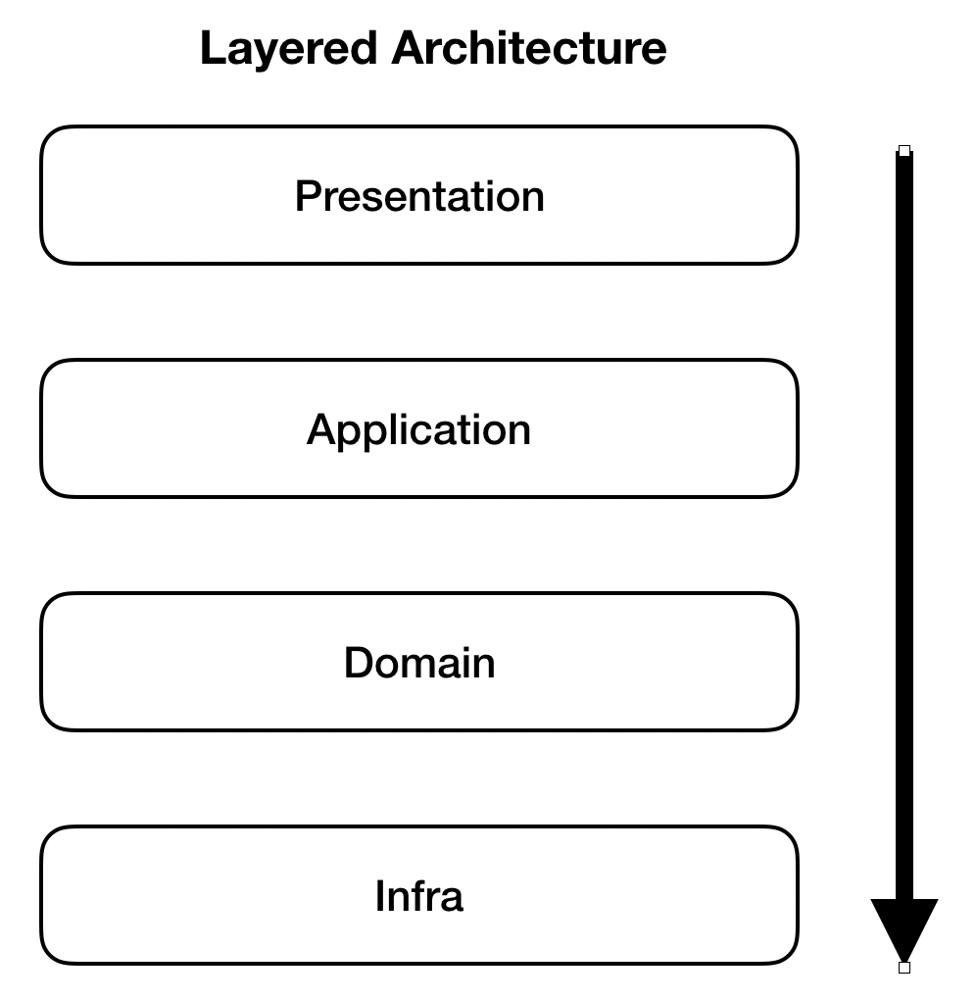

# Library 도서 관리 프로젝트

## Architecture
- Domain Driven Design (도메인 주도 설계)

### Domain Driven Design (도메인 주도 설계) ?
- Presentation Layer (Controller)
    - 사용자 요청에 대해 해석하고 응답하는 일을 책임지는 계층
    - 유일하게 사용자가 접근가능한 계층으로 사용자에게 UI를 제공하거나 데이터를 응답하는 모든 클래스가 해당한다.

- Application Layer (Service)
    - 비즈니스 논리가 포함되있지 않고 SW가 수행할 작업을 정의하고 데이터의 상태변화 같은 실질적인 비즈니스 로직의 호출을 위해 도메인 계층과 인프라스트럭쳐 계층을 연결해주는 계층
    - 실제로 트랙잭션을 관리하는 계층

- Domain Layer (Model)
    - 비즈니스 규칙, 비즈니스 로직에 대한 실질적인 도메인에 대한 정보를 갖고 있고 도메인의 역할과 책임을 지는 계층
    - Entity, Service, Repository (Interface) 가 이에 해당 된다.

- Infrastructure Layer (Repository)
    - 데이터베이스나 외부 연동과 같은 처리를 진행하는 계층
    - Domain Layer 에서 작성한 Interface 를 실질적으로 구현하는 부분 (impl)

- 장점
    - 각 레이어의 응집도를 높히고, 레이어별 관심사에만 집중 할 수 있다.
    - 핵심 비즈니스 로직을 순수하게 유지하기 때문에 유지보수와 확장성 측면에서 이득을 얻을 수 있다.

- 단점
    - 다른 관심사가 생길 경우 패키지 분리 및 코드 배치가 어렵다.

### Git 커밋 메세지 규칙  
- feat : 새로운 기능에 대한 커밋 
- fix : 버그 수정에 대한 커밋 
- build : 빌드 관련 파일 수정 / 모듈 설치 또는 삭제에 대한 커밋 
- chore : 그 외 자잘한 수정에 대한 커밋 
- ci : ci 관련 설정 수정에 대한 커밋 
- docs : 문서 수정에 대한 커밋 
- style :코드 스타일 혹은 포맷 등에 관한 커밋 
- refactor : 코드 리팩토링에 대한 커밋 
- test : 테스트 코드 수정에 대한 커밋 
- perf : 성능 개선에 대한 커밋  

ex) [feat] xxxx 기능 개발
